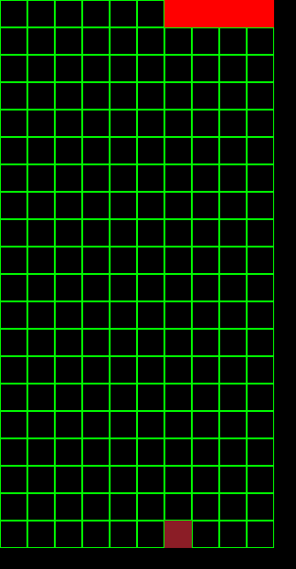
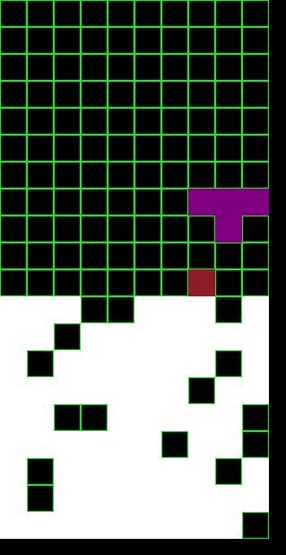
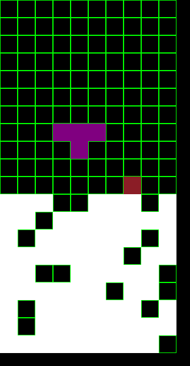
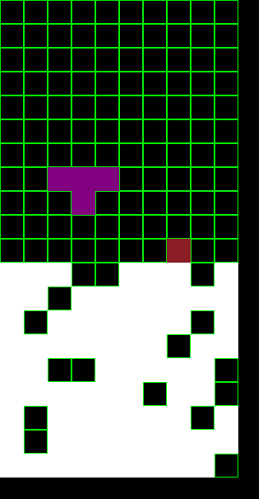
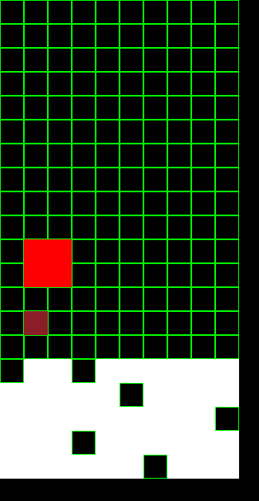
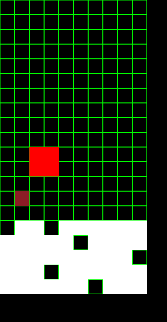

# AITRIS
Tetris powered by EmbASP. Project developed for Unical's AI Course.

# Requirements

The program is meant to be run on a linux OS

### 1) Python

We assure compatibility only with python 3.11 and 3.12, but should work with every python version >3.9

To install python you need to refer to your package manager (apt, pacman, ecc)

### 2) antlr4

We assure compatibility only with version 4.7.0

```bash
pip install antlr4-python3-runtime==4.7.0
```

If pip installation goes wrong you may need to use '--break-system-packages' has follow:

```bash
pip install antlr4-python3-runtime==4.7.0 --break-system-packages
```

### 3) EmbASP

We assure compatibility only with version 7.2.0

Version 7.2.0 can be downloaded [here](https://github.com/DeMaCS-UNICAL/EmbASP/releases/download/7.2.0/EmbASP-7.2.0-py2.py3-none-any.whl)
Or you can download from the full list [here](https://github.com/DeMaCS-UNICAL/EmbASP/releases) but it may not work

```bash
pip install EmbASP-7.4.0-py2.py3-none-any.whl
```

If pip installation goes wrong you may need to use '--break-system-packages' has follow:

```bash
pip install EmbASP-7.4.0-py2.py3-none-any.whl --break-system-packages
```
### 4) DLV2

Install DLV2 from [here](https://drive.google.com/file/d/1cM6w_gAJ8A_ARxPIPoXgF2oPu3Iy06dC/view)
Or else, you can download from the full list [here](https://dlv.demacs.unical.it/)

After you need to rename the file in 'dlv2' and insert it in executables/ folder project 


# Instruction

To launch the game:
```bash
python3.12 aitris.py
```

# Games note

The game is the classic Tetris: pile up various shape until you reach the roff

In particular in this implementation:



The read square is the position decide by the AI

# Implementation

The AI is been develop with this type of reasoning:
- Find all the valid position in the empty board of the game
- Select the lowest position in the board (for all possible rotation of the Tetromino!)
- Prefer a rotation (for example with T we prefer the 180° rotation, always)
- After selecting a Tetromino and his rotation, find the column where it fits better or where it occupies the least amount of empty blocks below

### Example to fits better:

*Prefer* this:



_to this:_



_or this:_




### Example of occupies the least amount of empty blocks below:

*Prefer* this:



_to this:_



_or this:_


