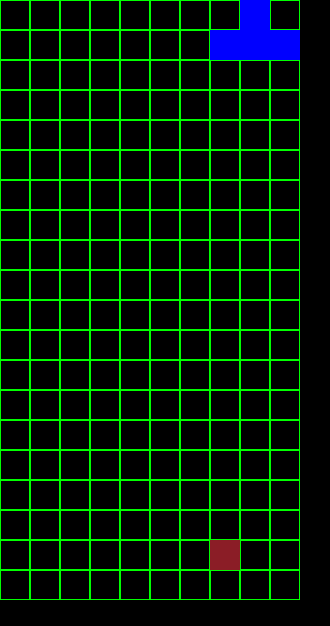
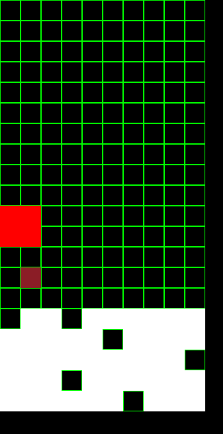

# AITRIS

Tetromino-based puzzle video game powered by the EmbASP tech. <br>
Project developed for Unical's [AI Course](https://sites.google.com/unical.it/inf-intelligenzaartificiale).

# Requirements

**The program is currently designed to run solely on a Linux distribution.**

### 1) Python

We guarantee compatibility with Python versions 3.11 and 3.12, but it should work from version 3.9 onwards.

You can install Python with your preferred package manager (e.g. apt, pacman, ...)

### 2) antlr4

We guarantee compatibility only with version 4.7.0.

Use the following pip command to install it:

```bash
pip install antlr4-python3-runtime==4.7.0
```

In case of any issues with the package installation, you might need to use the `--break-system-packages` flag.

```bash
pip install antlr4-python3-runtime==4.7.0 --break-system-packages
```

### 3) EmbASP

We guarantee compatibility only with version 7.2.0.

You can download it directly through this [link](https://github.com/DeMaCS-UNICAL/EmbASP/releases/download/7.2.0/EmbASP-7.2.0-py2.py3-none-any.whl), or you can check for a more recent version in the [official GitHub repository](https://github.com/DeMaCS-UNICAL/EmbASP/releases) (although we do not guarantee full functionality with other versions).

Use the following pip command to install it via the local file:

```bash
pip install EmbASP-7.4.0-py2.py3-none-any.whl
```

In case of any issues with the package installation, you might need to use the `--break-system-packages` flag.

```bash
pip install EmbASP-7.4.0-py2.py3-none-any.whl --break-system-packages
```

### 4) DLV2

Currently, only DLV 2.1.0 supports Python.

You can download it through this [link](https://drive.google.com/file/d/1cM6w_gAJ8A_ARxPIPoXgF2oPu3Iy06dC/view), or you can check for a more recent version in the [official website](https://dlv.demacs.unical.it/) (although it should only work with version 2.1.0).

**Make sure** to rename the solver to `dlv2` and place it in the `executables/` folder.

# Instruction

To play the game, simply run the main source file:
```bash
python3.12 aitris.py
```

You can pause the game by pressing the `P` key.

# Game basics

This is a classic tetromino puzzle game: stack various shapes until you reach the roof.



In this screenshot you can see the game board, the current piece and the "Vision" (the red square), which indicates the position chosen by the AI.

# Implementation

The AI has been developed with the following focal points:
1. Analyze and identify all the valid positions on the empty game board.
2. Select the lowest position on the board (while also considering all possible rotations of the Tetromino).
3. Prefer a specific rotation (e.g. for the T Tetromino, always prefer the 180° rotation).
4. After selecting a Tetromino and its rotation, find the column where it fits best or where it occupies the least number of empty blocks below.

### Example of Optimal Execution:

**Prefer** this:


_over this:_


_or this:_


### Example of Occupying the Least Empty Blocks Below:

**Prefer** this:


_over this:_


_or this:_


